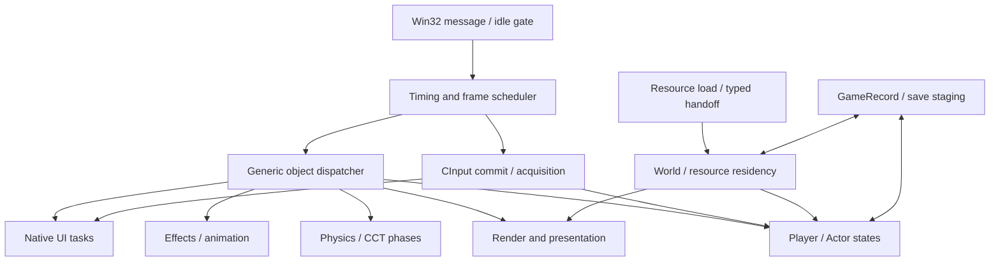
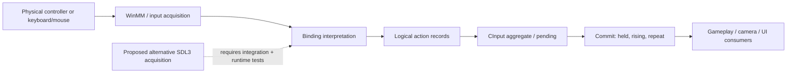

# Engine map | The big picture

[← Research atlas](README.md) · [MegaRE synthesis](engine/mega-re-final.md) · [Primary flow map](evidence/mega_re_final_2026-10-08/maps/FINAL_ENGINE_FLOW_MAP.md)

This is a **navigation diagram**, not a newly validated control-flow graph. Solid arrows summarize selected mapped relationships; they do not claim every runtime branch, fixed cadence or complete owner/lifetime closure. Read the linked source material for exact build-specific boundaries.

## Whole-engine reading map

**High-value boundary:** the dispatcher contains multiple ordered phases. A function found in this graph is *not* automatically a per-frame updater, and a static request edge does not prove successful work. Sources: [frame pipeline](evidence/mega_re_final_2026-10-08/maps/FRAME_AND_LIFECYCLE_PIPELINE.md), [object model](evidence/mega_re_final_2026-10-08/maps/OBJECT_MODEL_OVERVIEW.md).

## Physical gamepad input is not gameplay state

The SDL3 box represents an **engineering direction**, not an already verified game-native input structure or an assertion that the physical provider can replace every downstream interpreter. Sources: [Input architecture](input/README.md), [CInput evidence](evidence/cinput_pipeline/README.md), [controller flow](evidence/mega_re_final_2026-10-08/maps/FLOW_CONTROLLER_INPUT.md).

## What “draw distance” does *not* mean

| Separate domain | Read |
| :-- | :-- |
| Main-camera frustum classes | [Frustum](world/frustum.md) |
| Active world objects | [World](world/README.md) |
| Mesh detail and representation | [LOD](world/lod.md) · [Residency](world/residency.md) |
| Directional shadow relevance | [Shadows](world/shadows.md) |
| NPC / light / effect special policies | [Open questions](unresolved.md) · [Effects](engine/effects.md) |

A known set of six main-camera constants is **not** an exhaustive list of world, NPC, lighting and shadow distance controls.

---

For a detailed, address-backed map rather than this overview, read [MegaRE final engine flow](evidence/mega_re_final_2026-10-08/maps/FINAL_ENGINE_FLOW_MAP.md).
